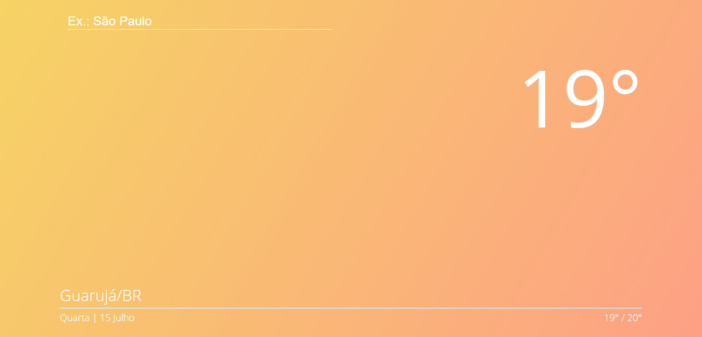

<h1 align="center">Clima Hoje</h1>

  <a href="#-projeto">Projeto</a>&nbsp;|&nbsp;
  <a href="#rocket-tecnologias">Tecnologias</a>&nbsp;|&nbsp;
  <a href="#-layout">Layout</a>&nbsp;|&nbsp;
  <a href="#memo-licença">Licença</a>

## 💻 Projeto

Clima Hoje foi criado para melhorar meus conhecimentos sobre consumo de API com ReactJS.
Neste projeto consumo a API da Open Weather para criar uma plataforma de busca de temperatura por cidade, no inicio a aplicação pede para pegar a localização do usuário e com isso é exibido a temperatura atual, minima e máxima do dia.

No buscadador, escolhendo uma cidade digitando o nome tanto em português quanto inglês é exibida as informações atuais da cidade.

## 🚀 Tecnologias

 - ReactJS;
 - Javascript;
 - Axios;
 - Geolocalização;
 - ESLint;

 ## 🎨 Layout

O layout do projeto é alterado de acordo com o horário que é acessado. Na primeira imagem, acesso de dia e na segunda acesso durante a noite.

## 📃 Licença

Esse projeto está sob a licença MIT.

---

Feito com ♥ by Emerson Leonardo